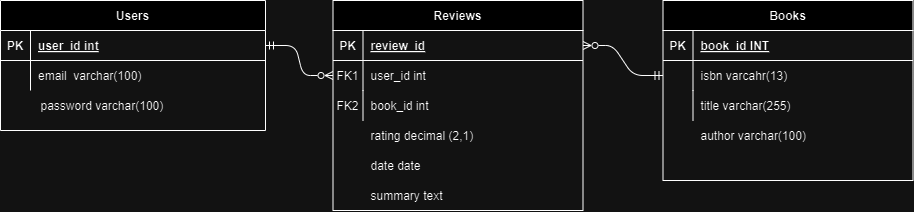

# IMPORTANT NOTE
- This application is to showcase skills in web fullstack development.
- IT IS NOT HOSTED ONLINE but can be tested on localhost
# Bookery
This project is a book review application where a user can login using basic authentication (username and password) or google login. The user can then create, read, update, and delete book reviews. The application utilizes public apis to get book front covers and inspirational qoutes.

# Setup
## Database 
- In postgress create a database called Bookery
- Click on bookery database and run queries in "Bookery_sql.txt" to create all tables and dummy data.
## Code
- Cd into the repository
- USE npm i to install all necessary packages
- Use node index.js command to run the server on localhost:3000
## Login Test
- userA@gmail.com and password 123
- userB@gmail.com and password 123

# About
## Frontend
HTML, CSS, Bootstrap.
## Backend
JS, Node, express, ejs and postgres.
## Authentication
- Bcrypt + saltrounds, Session (coockies)
- OAuth (google login and register), Session (cookies)
## API Used
- https://openlibrary.org/dev/docs/api/covers
- https://docs.quotable.io/docs/api/b3b9b39f25dd9-get-random-quote

# Database Structure

